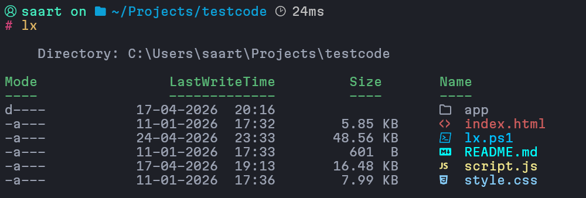
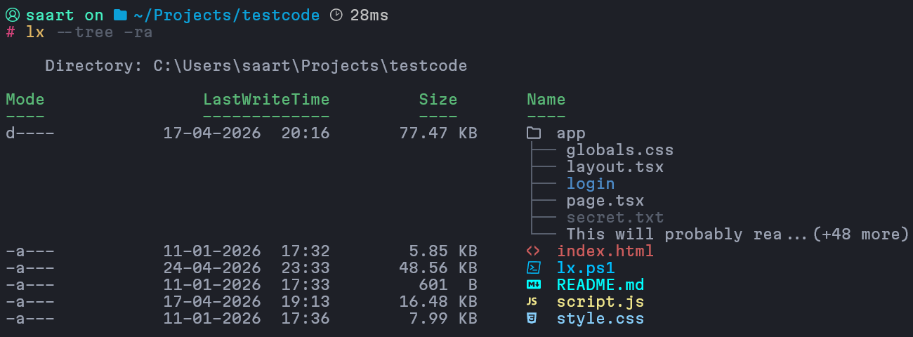

<h1 align="center"><code>lx</code></h1>

<h3 align="center">
  <p><code>ls</code><em> evolved</em></p>
</h3>

#

<div align="center">
  <p>
    
  </p>

  <p>
    
  </p>
</div>

`lx` is a PowerShell directory listing command with a compact table layout, human-readable sizes, inline tree previews, and optional recursive directory size calculation.

## Table Of Contents

- [Quick Start](#quick-start)
- [Requirements](#requirements)
- [Install](#install)
- [Core Commands](#core-commands)
- [Flags Reference](#flags-reference)
- [Performance And Cache](#performance-and-cache)
- [Tree Mode](#tree-mode)
- [Hyperlinks](#hyperlinks)
- [Behavior Notes](#behavior-notes)
- [Troubleshooting](#troubleshooting)
- [References](#references)

## Quick Start

Install from GitHub with one command:

```powershell
irm https://raw.githubusercontent.com/saarthaksinghal/lx/main/install.ps1 | iex
```

That installer:

- downloads `lx.ps1` into your current folder
- attempts to load `lx` in the current session

If you are already in this folder:

```powershell
. .\lx.ps1
lx
lx -r
lx -rs --tree
```

> [!INFO]
> If you want `lx` available in every PowerShell session, add this line to `$PROFILE`:
>
> ```powershell
> . 'C:\path\to\lx.ps1'
> ```

## Requirements

### Required

- PowerShell `7+`

### Strongly Recommended

- [`Terminal-Icons`](https://github.com/devblackops/Terminal-Icons) for colored file and folder icons
- A [`Nerd Font`](https://www.nerdfonts.com/) in your terminal so icons render correctly instead of showing missing glyph boxes
- A terminal with ANSI / VT support such as Windows Terminal for cleaner colors and hyperlink support

### Useful To Know

- `lx` still works without `Terminal-Icons`; it just falls back to plain names or built-in icon replacements
- `lx` still runs without a Nerd Font, but icon glyphs may look broken or incomplete
- recursive size caching is stored beside the script as `.lx-size-cache.json`

## Install

### Manual Install

### Option 1: Load In The Current Session

Dot-source the script from its full path:

```powershell
. 'C:\path\to\lx.ps1'
```

Then run:

```powershell
lx
```

### Option 2: Add It To `$PROFILE`

1. Put `lx.ps1` in a permanent folder.
2. Open your PowerShell profile.
3. Add a dot-source line that points to that file.
4. Reload the profile.

Example:

```powershell
notepad $PROFILE
```

Add this line to `$PROFILE`:

```powershell
. 'C:\path\to\lx.ps1'
```

Reload and test:

```powershell
. $PROFILE
lx
lx --tree
lx -r
```

> [!IMPORTANT]
> Put the dot-source line near the end of `$PROFILE` so later profile code does not overwrite the function.

## Core Commands

### Standard Listing

```powershell
lx
lx .
lx C:\Projects
```

### Scan Two Folders Separately

```powershell
lx C:\Projects C:\Downloads
```

### Show Hidden Files

```powershell
lx -a
```

### Recursive Directory Sizes

```powershell
lx -r
```

### Sort By Size

```powershell
lx -s
lx --sort=asc
lx --sort=desc
```

### Combine Common Flags

```powershell
lx -rs
lx -ra
lx -rsa
```

### Enable Tree Preview

```powershell
lx --tree
lx -a --tree
lx -r --tree
lx -rs --tree
```

### Enable Clickable Directory Links

```powershell
lx --links
lx --tree --links
```

## Flags Reference

<table>
  <thead>
    <tr>
      <th width="220">Flag</th>
      <th>What It Does</th>
    </tr>
  </thead>
  <tbody>
    <tr><td><code>-a</code></td><td>Show hidden files and folders.</td></tr>
    <tr><td><code>-r</code></td><td>Calculate recursive directory sizes for top-level directories.</td></tr>
    <tr><td><code>-s</code></td><td>Sort top-level rows by size descending.</td></tr>
    <tr><td><code>-rs</code></td><td>Enable recursive sizes and descending size sort.</td></tr>
    <tr><td><code>-ra</code></td><td>Enable recursive sizes and hidden/all-files mode.</td></tr>
    <tr><td><code>-rsa</code></td><td>Enable recursive sizes, size sort, and hidden/all-files mode.</td></tr>
    <tr><td><code>--sort=asc</code></td><td>Sort top-level rows by size ascending.</td></tr>
    <tr><td><code>--sort=desc</code></td><td>Sort top-level rows by size descending.</td></tr>
    <tr><td><code>--tree</code></td><td>Show one-level inline tree previews for top-level directories.</td></tr>
    <tr><td><code>--tree=false</code></td><td>Disable tree previews explicitly.</td></tr>
    <tr><td><code>--links</code></td><td>Make top-level directories and tree-preview directories clickable when the terminal supports hyperlinks.</td></tr>
    <tr><td><code>--links=false</code></td><td>Disable clickable links explicitly.</td></tr>
    <tr><td><code>--clear-cache</code></td><td>Delete the persistent recursive-size cache file.</td></tr>
    <tr><td><code>--cache-size</code></td><td>Print cache path, last write time, and cache file size.</td></tr>
  </tbody>
</table>

## Performance And Cache

`lx.ps1` is intended to make recursive size commands feel much better in day-to-day use.

### Recursive Size Optimisations

- recursive-size work is precomputed before rows are rendered, so top-level directory rows do not each trigger their own full recursive walk
- the hot recursive-size path is backed by a lazy-loaded embedded C# scanner built on `.NET System.IO.Enumeration`
- that scanner avoids creating full PowerShell `FileInfo` objects for every file, which reduces allocation overhead compared with `Get-ChildItem -Recurse | Measure-Object`
- top-level directories are scanned in a batch with bounded parallelism instead of being recalculated one by one
- the scanner skips reparse points, ignores inaccessible entries, and excludes `.lx-size-cache.json` from recursive totals
- repeated runs benefit from a short-lived persistent cache plus an in-memory runtime cache for the current invocation

### What The C# Scanner Improves

- uses the filesystem enumerator directly instead of pushing every file through the full PowerShell pipeline
- reads file lengths during enumeration, then accumulates totals in the scanner instead of materialising large object streams first
- keeps the plain `lx` path lightweight because the C# helper is only compiled and loaded when recursive sizing is actually needed
- makes cold `-r` runs much faster on large directory trees while keeping warm cache hits effectively instant

### Cache Behavior

- cache file: `.lx-size-cache.json`
- cache location: beside the loaded script
- default TTL: `5 minutes`
- stale entries are pruned automatically
- if no valid entries remain, the cache file is removed automatically

Useful commands:

```powershell
lx --cache-size
lx --clear-cache
```

## Tree Mode

When `--tree` is enabled:

- only top-level directories get previews
- files remain single-line rows
- preview depth is currently fixed at `1`
- only immediate children are shown
- preview children are always sorted by name
- previews respect `-a`
- unreadable directories fail closed and simply show no preview lines

### Tree Truncation

Only tree preview lines are truncated.

If a child name would overflow the available width, `lx` shortens it like this:

```text
very-long-file-name-th...(+20 more)
```

That keeps tree previews readable without changing the main top-level rows.

## Hyperlinks

When `--links` is enabled:

- top-level directory names are rendered as terminal hyperlinks
- tree-preview directory names are also hyperlinked
- files remain plain text
- the exact click behavior depends on your terminal

If the terminal does not support OSC 8 hyperlinks, `lx` falls back to normal text automatically.

## Behavior Notes

- directory sizes shown by `-r` are recursive totals for each top-level directory row
- file sizes are always direct file sizes, not recursive values
- tree previews are memoized only for the current invocation
- the recursive-size cache file is excluded from recursive totals
- reparse points are not followed during recursive-size scans
- main-row icon rendering depends on `Format-TerminalIcons` when available
- tree continuation lines stay aligned under the `Name` column

## Troubleshooting

### The Script Is Blocked By Windows

Unblock the file once:

```powershell
Unblock-File .\lx.ps1
```

### `lx` Is Not Found

Make sure you dot-sourced the script:

```powershell
. .\lx.ps1
```

### Icons Are Missing

Install `Terminal-Icons`, then restart PowerShell or reload your profile.

### Hyperlinks Do Not Work

Use a hyperlink-capable terminal such as Windows Terminal and enable `--links`.

### Recursive Sizes Feel Wrong Or Outdated

Clear the cache and rerun:

```powershell
lx --clear-cache
lx -r
```

## References

- [`Terminal-Icons`](https://github.com/devblackops/Terminal-Icons) for colored file and folder icons in the main `Name` column
- [`MartianMono Nerd Font`](https://www.nerdfonts.com/font-downloads#:~:text=Version%3A%201%2E1%2E0) used for proper rendering of the icon glyphs
- [`Firewatch`](https://windowsterminalthemes.dev/?theme=Firewatch) windows terminal theme used to improve UI
- Unicode box-drawing characters for inline tree preview rendering
  